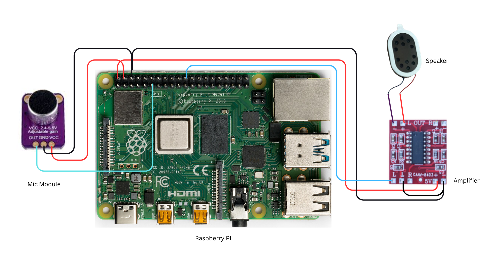

# Troubleshooting Guide

## 1. No Sound from the Speaker

### Possible Causes

- Loose wiring connection
- Amplifier not powered properly
- Incorrect GPIO connection
- Speaker polarity issue

### Solutions

- Check all jumper wire connections carefully.
- Ensure the amplifier VCC is connected to the Raspberry Pi 5V pin.
- Verify the amplifier GND is connected to Raspberry Pi GND.
- Make sure the speaker wires are connected to the amplifier output terminals correctly.
- Confirm the GPIO pin used in the code matches the physical wiring.

## 2. Microphone Not Detecting Sound

### Possible Causes

- Incorrect OUT pin connection
- Microphone module not receiving power
- GPIO pin configured incorrectly

### Solutions

- Verify:
  - VCC → 5V
  - GND → GND
  - OUT → GPIO pin
- Check the microphone sensitivity knob (if available) and adjust it slowly.
- Test using another GPIO pin if detection fails.
- Ensure the software reads the correct GPIO number.

## 3. Distorted or Low Audio Output

### Possible Causes

- Low power supply
- Volume too high
- Weak amplifier connection

### Solutions

- Use a stable 5V power source.
- Reduce amplifier gain/volume.
- Keep jumper wires short and secure.
- Avoid loose speaker terminals.

## 4. Raspberry Pi Not Detecting GPIO Signals

### Possible Causes

- Wrong GPIO numbering mode
- Damaged GPIO pin
- Wiring mismatch

### Solutions

- Double-check GPIO pin numbers in the code.
- Use BCM numbering consistently.
- Test with another GPIO pin.
- Reboot the Raspberry Pi after reconnecting modules.

## 5. Amplifier Heating Up

### Possible Causes

- Incorrect polarity connection
- Short circuit
- Overpowered speaker

### Solutions

- Immediately disconnect power.
- Recheck:
  - 5V → Positive (+)
  - GND → Negative (-)
- Inspect wires for accidental contact.
- Use a compatible low-power speaker.

## 6. Background Noise or Buzzing Sound

### Possible Causes

- Shared noisy power line
- Poor grounding
- Interference from nearby electronics

### Solutions

- Ensure all modules share a common GND.
- Use quality jumper wires.
- Keep microphone wires away from power cables.
- Reduce amplifier gain slightly.

## 7. Raspberry Pi Not Powering Properly

### Possible Causes

- Too many components drawing power
- Weak USB power adapter

### Solutions

- Use an official or high-quality Raspberry Pi power adapter.
- Disconnect unnecessary components during testing.
- Check for short circuits before powering on.

## Quick Wiring Verification Checklist

### Microphone Module

- VCC → 5V
- GND → GND
- OUT → GPIO

### Audio Amplifier

- +5V → 5V
- GND → GND

### Speaker

- Speaker + → Amplifier OUT
- Speaker – → Amplifier GND

## Wiring Diagram

## Safety Tips

- Turn off the Raspberry Pi before changing wiring.
- Never connect 5V directly to a GPIO pin.
- Double-check all polarity connections before powering the system.

## Wiring Quick Guide

### 1. Microphone Setup

- VCC: Connect to the 5V pin on the Raspberry Pi.
- GND: Connect to any GND (Ground) pin.
- OUT: Connect to an available GPIO pin.

### 2. Audio Amplifier Setup

- Positive (+) / 5V: Connect to the 5V pin.
- Negative (-) / Minus: Connect to a GND pin.

### 3. Speaker (L) Connections

- Signal side: Connect to a GPIO pin.
- 't' side: Connect to a GND pin.
